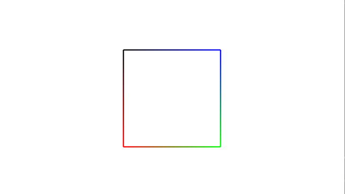
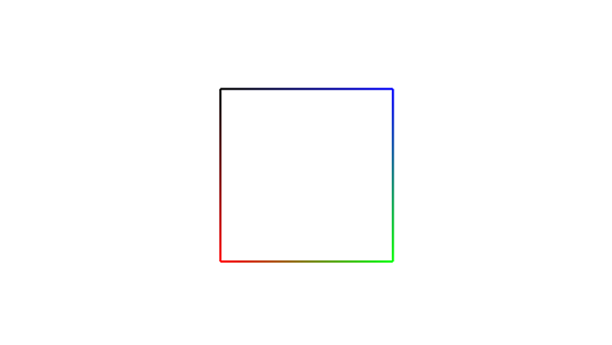

# P01_Preparation
- 더 자세한 설명은 첨부된 [HW01_Report.pdf](./HW01_Report.pdf)를 확인하길 바란다. 
- EXE와 SOURCE 폴더에는 실행파일과 소스코드를 확인할 수 있다.
## Contents
- Prepare the develop environment
- Set up OpenGL, GLU, and GLFW
- Draw a rectangle using GL_LINE_LOOP
## Practice
1. Draw a rectangle using GL_LINE_LOOP
## Exercise
1. Draw a rectangle using GL_LINES

### OpenGL and GLU
- Overview
    -  www.opengl.org
    -  Cross-language, cross-platform API for rendering 2D and 3D vector graphics
    -  API for interacting with GPU to achieve hardware-accelerated rendering

### GLFW
- Overview
    - www.glfw.org
    - Open source, multi-platform library for OpenGL, OpenGL ES and Vulkan
    - API for creating windows and contexts, receiving input and event
    - Supports Windows, macOS, and the X Window System
- Installation
    - Download pre-compiled binaries from www.glfw.org  
    (32-bit or 64-bit Windows binaries of your choice)
    - Put include/GLFW into {VC Root}/include
    - Put lib-vc\<version>/*.lib into {VC Root}/lib
    - Put lib-vc\<version>/*.dll into %SystemRoot%/system32
- Usage
    - Include the GLFW include file using #include <GLFW/glfw3.h>
    - Add the GLFW library file glfw3.lib for linking  
    (Project | Properties | Linker | Input | Additional Dependencies)
    - Add the OpenGL library files opengl32.lib and glu32.lib for linking

( {VC ROOT} = C:\Program Files (x86)\Microsoft Visual Studio\2019\Community\VC\Tools\MSVC\14.27.29110\ )

### GLFW – Local Installation
- Installation
    - Make include and lib directories in your working directory
    - Download pre-compiled binaries from www.glfw.org  
    (32-bit or 64-bit Windows binaries of your choice)
    - Put the directory include/GLFW into your include directory
    - Put all the library files in lib-vc\<version> into your lib directory
- Project setting
    - Add include directory in your project  
    (Project | Properties | C/C++ | General | Additional Include Directories)
    - Add lib directory in your project  
    (Project | Properties | Linker | General | Additional Library Directories)

### Demo - Practice
-  Draw a rectangle using GL_LINE_LOOP

### Demo - Exercise
- Draw a rectangle using GL_LINES instead of GL_LINE_LOOP

practice는 GL_LINE_LOOP를 사용하기 때문에 사각형의 서로 다른 꼭짓점 4개를 vertex로 주었지만,  
exercise에서는 GL_LINES를 사용해야 하기 때문에 사각형의 네 변을 이루는 종점 8개를 순서대로 vertex로 주어 문제를 해결하였다.  
※ 여기서 주의할 점은 GL_LINES의 경우 연속되는 두 vertex를 사용해 선분을 그린다.

