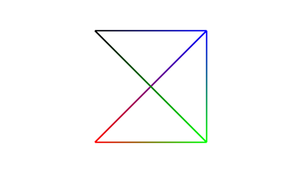
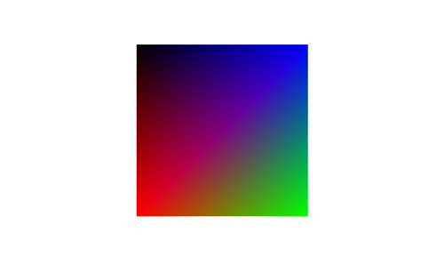

# P02_Primitives_and_Keyboard_Input
- 더 자세한 설명은 첨부된 [HW02_Report.pdf](./HW02_Report.pdf)를 확인하길 바란다. 
- EXE와 SOURCE 폴더에서는 실행파일과 소스코드를 확인할 수 있다.
## Contents
- Primitives: points, lines, triangles, polygon, …
- Line stippling and polygon filling
- Keyboard input in GLFW
## Practice
1. Draw 8 primitives
2. Stippling on/off
3. Polygon filling on/off
## Exercise
1. Use GL_QUADS to draw 2 quads with 8 vertices
2. Use GL_QUAD_STRIP to draw 3 quads with 8 vertices
3. Use GL_FILL and GL_LINE in (1) and (2)

### Demo - Practice
- Draw 8 primitives

　　　　　　　Keyboard Input으로 1을 입력한 GL_POINTS 　　　　　　　　　　Keyboard Input으로 2를 입력한 GL_LINES
  

　　　　　　　Keyboard Input으로 3을 입력한 GL_LINE_STRIP 　　　　　　　　Keyboard Input으로 4를 입력한 GL_LINE_LOOP
  

　　　　　　　Keyboard Input으로 5을 입력한 GL_TRIANGLES　　　　　　　　　Keyboard Input으로 6를 입력한 GL_TRIANGLES_STRIP
  

　　　　　　　Keyboard Input으로 7을 입력한 GL_TRIANGLES_FAN　　　　　　　Keyboard Input으로 8를 입력한 GL_POLYGON
  

- Stippling on/off

　　　　　　　　　　　GL_LINES (stippling on) 　　　　　　　　　　　　　　　　　GL_LINE_STRIP (stippling on)
  

　　　　　　　　　　　GL_LINE_LOOP (stippling on) 　　　　　　　　　　　　　　　GL_TRIANGLES (stippling on)
  

　　　　　　　　　　　GL_TRIANGLES_STRIP (stippling on) 　　　　　　　　　　　　GL_TRIANGLES_FAN (stippling on)
  

　　　　　　　　　　　　　　　　　　　　　　　　　　GL_POLYGON (stippling on)
  
이전 Draw 8 primitives에서는 모든 primitives를 stippling off하여 그렸고, 위 Stippling on/off에서는 모든 primitives를 stippling on하여 그렸다.
그리고 GL_POINTS는 stippling을 on/off 하여도 같은 결과이므로 생략하였다.  
  

- Polygon filling on/off

　　　　　　　　　　　GL_TRIANGLES (filling on) 　　　　　　　　　　　　　　　　GL_TRIANGLES_STRIP (filling on)
  

　　　　　　　　　　　GL_TRIANGLES_FAN (filling on) 　　　　　　　　　　　　　　GL_POLYGON (filling on)
  

### Demo - Exercise
- Use GL_QUADS to draw 2 quads with 8 vertices

　　　　　　　　　　　　　　　GL_QUADS를 사용하여 8개의 vertices로 그린 2개의 사각형 (GL_LINE state)
  

- Use GL_QUAD_STRIP to draw 3 quads with 8 vertices

　　　　　　　　　　　　　　GL_QUAD_STRIP를 사용하여 8개의 vertices로 그린 2개의 사각형 (GL_LINE state)
  

- Use GL_FILL and GL_LINE in (1) and (2)

　　　　　　　　　　　　　　　GL_QUADS를 사용하여 8개의 vertices로 그린 2개의 사각형 (GL_FILL state)
  

　　　　　　　　　　　　　　GL_QUAD_STRIP를 사용하여 8개의 vertices로 그린 2개의 사각형 (GL_FILL state)
   

위와 같은 과정을 통해서 GL_QUADS를 쓰는 것보다 GL_QUAD_STRIP을 쓰는 것이 똑같은 8개의 vertices를 사용하더라도 더 많은 사각형을 만들어냄을 알 수 있었다. 

  
※ 여기서 주의할 점은 아래 나온 그림과 같이 GL_QUADS는 CCW를 따르기 때문에 회전하도록 vertex를 부여하면 되지만 GL_QUAD_STRIP의 경우에는 zigzag 패턴으로 vertex를 부여해야 함으로 같은 순서로 vertex를 주어서는 똑같은 그림을 얻을 수 없다.  

출처 : https://www.3dgep.com/wp-content/uploads/2011/02/OpenGL-Primitives.png
