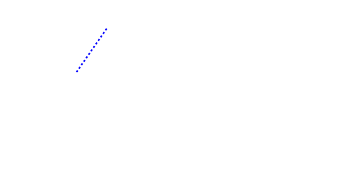
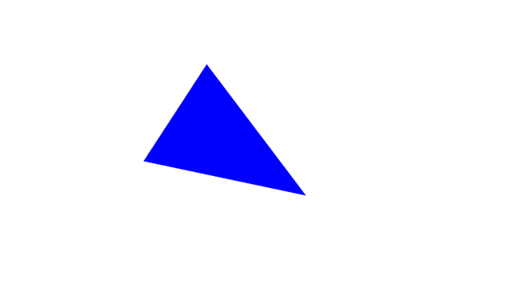
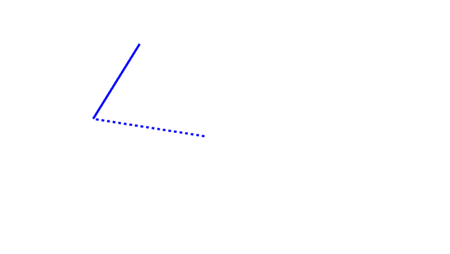
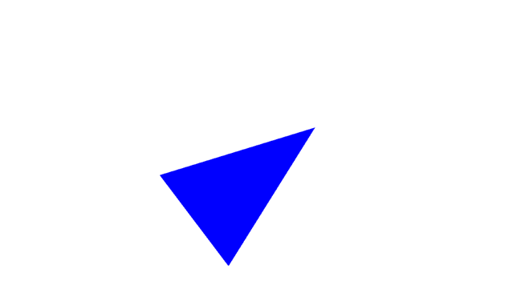

# P03_Interaction_and_Animation
- 더 자세한 설명은 첨부된 [HW03_Report.pdf](./HW03_Report.pdf)를 확인하길 바란다. 
- EXE와 SOURCE 폴더에는 실행파일과 소스코드를 확인할 수 있다.
## Contents
- Mouse input for drawing a line segmen
- Timer for animating a line segment
## Practice
1. Mouse input for drawing a line segment
2. Timer for animating a line segment
## Exercise
1. Draw a triangle by clicking the left mouse button 3 times
2. Draw dashed lines while moving the mouse pointer after the first click
3. Rotate the triangle

### Demo - Practice
- Mouse input for drawing a line segment

처음 Screen에 MOUSE_LEFT를 PRESS 했을 때는 선분을 구성하는 시작점과 끝점이 동일한 좌표로 지정되어 Screen에 아무런 모습도 출력되지 않는다. 
그리고나서 MOUSE의 LEFT를 누른 체로(DRAGGING) 커서를 이동하면 해당 커서의 좌표가 끝점으로 지정되고, 초기에 지정된 시작점과 끝점을 Stipple로 GL_LINES를 그리게 된다. 
그리고 DRAGGING 상태에서 MOUSE_LEFT를 Release 했을 때는 NONE 상태로 바뀌어 Stipple로 그려지던 GL_LINES가 Stipple이 꺼진 체로 그려지게 된다.    

- Timer for animating a line segment

Keyboard 입력으로 Space를 주게 되면 위 과정으로 그려진 선분이 원점기준으로 회전하게 된다.  
이때 방향키 UP key를 누르게 되면 Period가 증가하며 회전 각도의 변화량이 감소하고, 그로인해 회전 속도가 느려지게 된다.  
또한, DOWN key를 누르게 되면 반대로 Period가 감소하여 회전 각도의 변화량이 증가하고, 그로인해 회전 속도가 빨라지게 된다.   

### Demo - Exercise
-  Draw a triangle by clicking the left mouse button 3 times

세 번의 MOUSE_LEFT PRESS에 따라 삼각형의 세 꼭짓점 좌표가 정해지게 되고, 이렇게 지정된 세 꼭짓점으로 이루어진 삼각형을 그린다.
  

- Draw dashed lines while moving the mouse pointer after the first click

처음 NONE 상태에서는 아무것도 rendering 되는 것이 없다.  
그리고 Screen에 MOUSE_LEFT를 처음 PRESS 했을 때는 PROCEEDING 상태로 바뀌었지만 선분을 구성하는 세 점이 모두 동일한 좌표로 지정되어 이때도 Screen에는 아무런 모습도 출력되지 않는다.   
하지만 한 번의 MOUSE_LEFT를 PRESS 이후에 MOUSE를 move하게 되면 PRESS 했을 때의 커서 좌표는 고정되고 나머지 두 좌표가 커서의 좌표에 따라 같은 값으로 지정된다.  
여기서 첫번째 지정된 좌표와 MOUSE move에 따른 두 좌표를 잇는 GL_LINES가 Stipple로 그려지게 된다. 
  

위 과정에서 한 번 더 MOUSE_LEFT를 PRESS하게 되면 삼각형의 두 번째 점의 좌표가 지정되고, 첫 번째 점과 방금 지정된 두 번째 점을 잇도록 Stipple이 꺼진 GL_LINES로 그린다.  
그리고 MOUSE move에 따라 삼각형의 세 번째 점 좌표가 바뀌게 되고, 두 번째 점과 세 번째 점을 잇는 GL_LINES가 Stipple로 그려지게 된다.
  

- Rotate the triangle

Keyboard 입력으로 Space를 주게 되면 위 과정으로 그려진 선분을 원점기준으로 회전하게 된다.  
이 과정에서 방향키 UP key를 누르게 되면 Period가 증가하며 회전 각도의 변화량이 감소하고, 그로인해 회전 속도가 느려지게 된다.  
또한, DOWN key를 누르게 되면 반대로 Period가 감소하여 회전 각도의 변화량이 증가하고, 그로인해 회전 속도가 빨라지게 된다. 
  

이번 과제의 핵심은 practice에서 수행한 선분이나, exercise에서 수행한 삼각형 모두 지정하지 않은 좌표는 지정된 좌표와 값이 같아야 한다는 것이다.  
이를 통해 선분의 경우는 MOUSE_LEFT를 PRESS한 후 MOUSE move를 하지 않으면 선분이 그려지지 않고, 삼각형의 경우도 곧바로 삼각형이 그려지는 것이 아니라 MOUSE_LFET의 PRESS 횟수에 따라 삼각형을 구성하는 변의 개수가 점차 많아진다는 것이다. 