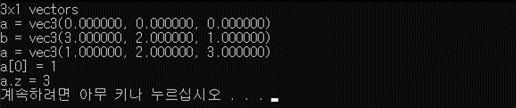
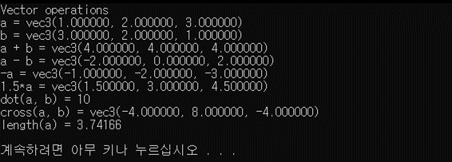
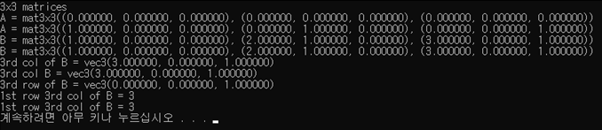
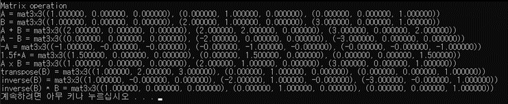
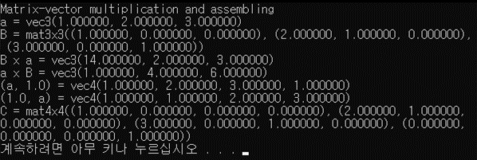
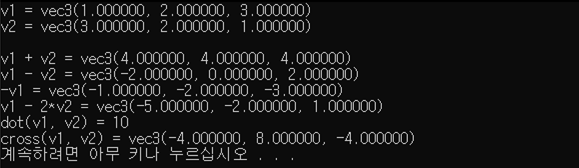
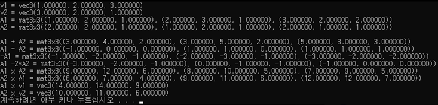

# P04_Linear_Algebra
- 더 자세한 설명은 첨부된 [HW04_Report.pdf](./HW04_Report.pdf)를 확인하길 바란다. 
- EXE와 SOURCE 폴더에는 실행파일과 소스코드를 확인할 수 있다.
## Contents
- GLM for OpenGL mathematics
- Vectors, matrices, and operations over them
## Practice
1. Vectors and vector operations (part 1 and 2)
2. Matrices and matrix operations (part 3 and 4)
3. Matrix-vector multiplication and assembling (part 5)
## Exercise
1. Vector operations
2. Matrix operations

### GLM
- C++ template library
    - Header files for OpenGL mathematics
- Installation
    - Download package from glm.g-truc.net
    - Unzip the downloaded zip file
    - Put the directory glm/glm into {VC Root}/include
- Usage
    - Include the GLM include file using #include <glm/glm.hpp>

### Demo - Practice
- Vectors and vector operations 
    - 3D Vector Representation
    - 3D Vector Operations

　　　　　　　　　　　　　　　　　　　　　main문의 Argument로 1을 준 상태로, 3x1 Vectors의 정보를 출력하고 있다. 
  

　　　　　　　　　　　　　　　　　　　　　main문의 Argument로 2을 준 상태로, Vector operations에 대한 결과를 출력하고 있다.
  

- Matrices and matrix operations 
    - 3x3 Matrix Representation
    - 3x3 Matrix Operations

　　　　　　　　　　　　　　　　　　　　　main문의 Argument로 3을 준 상태로, 3x3 matrices에 대한 정보를 출력하고 있다.
  

　　　　　　　　　　　　　　　　　　　　　main문의 Argument로 4을 준 상태로, Matrix operations에 대한 결과를 출력하고 있다.
  

- Matrix-vector multiplication and assembling
    - Matrix-vector multiplication in GLM
    - 4x1 vector from 3x1 vector
    - 4x4 homogeneous matrix from 3x3 matrix

　　　　　　　　　　　　main문의 Argument로 5를 준 상태로, Matrix-vector multiplication and assebling에 대한 정보 및 결과를 출력하고 있다.
  

### Demo - Exercise
-  Vector operations
    - $\vec{v_1} = ( 1 , 2 , 3 )$
    - $\vec{v_2} = ( 3 , 2 , 1 )$
    - $\vec{v_1} + \vec{v_2} =$
    - $\vec{v_1} - \vec{v_2} =$
    - $-\vec{v_2} =$
    - $\vec{v_1} - 2\vec{v_2} =$
    - $\vec{v_1} - \vec{v_2} =$
    - $\vec{v_1}\cdot\vec{v_2}$
    - $\vec{v_1}\times\vec{v_2}$

　　　　　　　　　　　main문의 Argument로 1을 준 상태로, vector V1, V2에 대한 정보와 Vector-vector operation에 대한 결과를 출력하고 있다.
  

-  Matrix operations
    - $A_1 = ((1, 2, 1), (2, 3, 1), (3, 2, 2))$
    - $A_2 = ((2, 2, 1), (1, 2, 1), (2, 1, 1))$
    - $A_1 + A_2 =$
    - $A_1 - A_2 =$
    - $-A_1 =$
    - $A_1 - 2A_2 =$
    - $A_1A_2 =$
    - $A_2A_1 =$
    - $A_1\vec{v_1} =$
    - $A_2\vec{v_2} =$

　　　　　　　　　　　　　　　　　main문의 Argument로 2을 준 상태로, vector V1, V2와 matrix A1, A2에 대한 정보를 출력하고.   
　　　　　　　　　　　　　　　　　Matrix operation, Matrix-vector multiplication에 대한 결과를 출력하고 있다.
  

※ 여기서 주의할 점은 실행되는 프로그램의 시스템에 따라 row-major, colum-major 등의 convention이 달라짐으로 이를 유의해야한다.