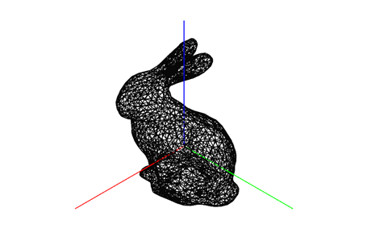

# P05_3D_Programming
- 더 자세한 설명은 첨부된 [HW05_Report.pdf](./HW05_Report.pdf)를 확인하길 바란다. 
- EXE와 SOURCE 폴더에서는 실행파일과 소스코드를 확인할 수 있다.
## Contents
- Draw OpenGL quadric objects: sphere, cylinder, disk 
- Read/draw a polygonal bunny model using points
## Practice
1. Draw OpenGL quadric objects: sphere, cylinder, disk 
2. Polygon fill on/off
3. Read/draw a bunny model using points
## Exercise
1. Extract all the edges and print # of edges of a bunny model
2. Draw the extracted edges using lines

### Demo - Practice
- Draw OpenGL quadric objects: sphere, cylinder, disk

　　　　　　　main문의 Argument에 순서대로 1, 2, 3을 준 상태로, OpenGL의 quardric objects인 sphere, cylinder, disk를 Polygon fill on 상태로 그리고 있다.
  

-  Polygon fill on/off

　　　　　　　main문의 Argument에 순서대로 1, 2, 3을 준 상태로, OpenGL의 quardric objects인 sphere, cylinder, disk를 Polygon fill off 상태로 그리고 있다.
  

- Read/draw a bunny model using points

　　　　　　　　　　　　　　　　　　　Bunny model의 Polygonal Mesh file을 read하고 points를 사용해 이를 그린 모습이다.
  

### Demo - Exercise
- Extract all the edges and print # of edges of a bunny model

# vertices, # faces, # Edges는 m01_bunny.off file에 적혀있는 해당 element의 개수이다. "count of edge = 6480"는 m01_bunny.off file내의 적혀있는 삼각형을 이루는 세 vertex를 통해 edge의 개수를 추출한 것이다. 이는 동적할당한 2차원 vector에 삼각형을 이루는 세 vertex를 사용하여 번호가 작은 vertex에서 큰 vertex로 향하도록 3개의 순방향 간선(forward edge)를 중복체크하여 저장하였다. 
  

-  Draw the extracted edges using lines

　　　　　　위 과정을 통해 추출해낸 겹치지 않는 모든 edge의 정보가 저장되어 있는 2차원 vector의 모든 element에 접근하여 이를 GL_LINES로 출력한 모습이다.
  

※ 이번 과제에서 주의할 점은 삼각형을 이루는 세 vertex 정보를 통해서 edge를 추출할 때 edge를 겹치지 않고 올바르게 추출하기 위해서  일정한 convention(순방향 간선)과 중복체크를 수행해야 한다는 것이다.